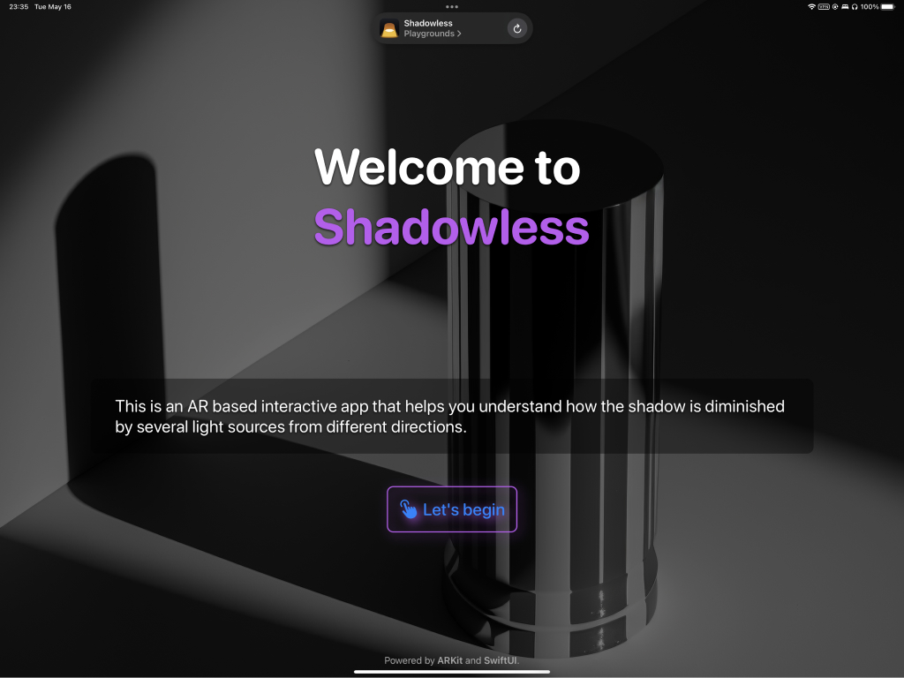
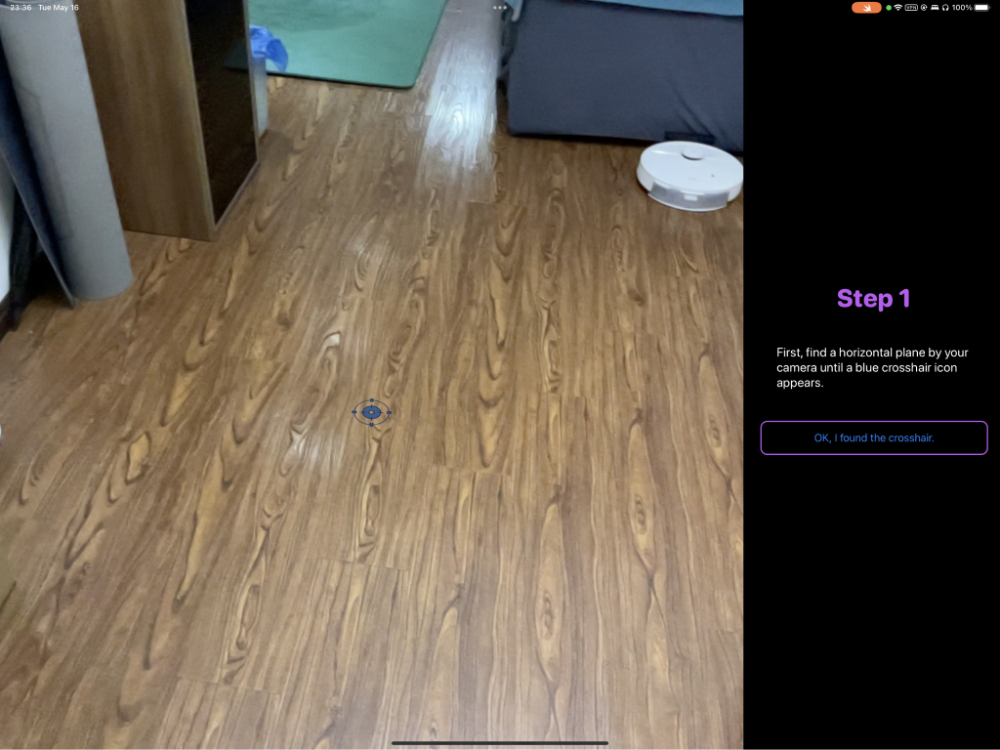
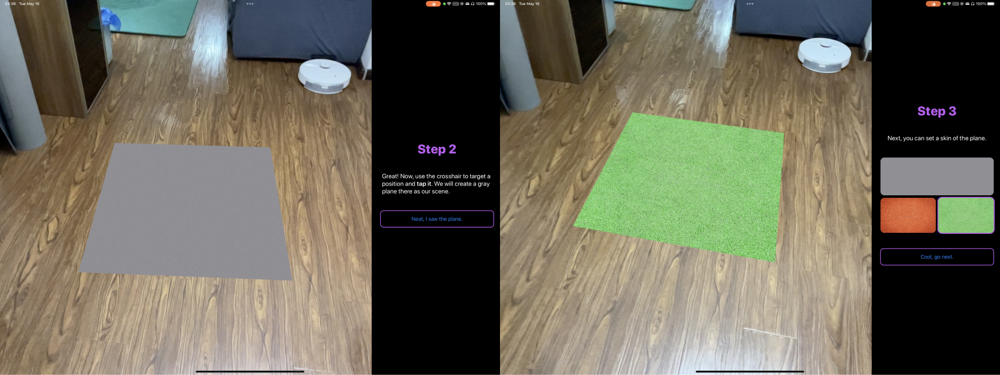
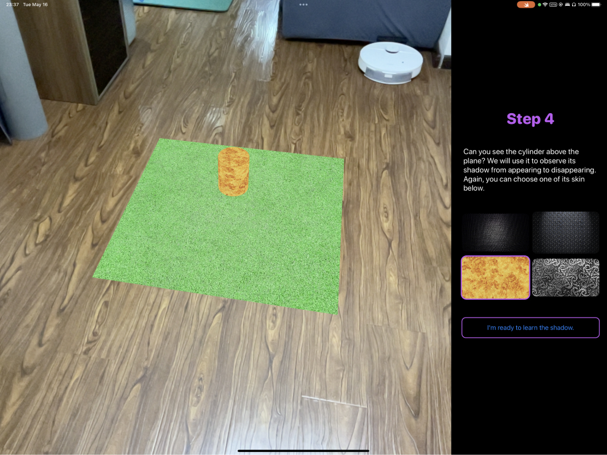
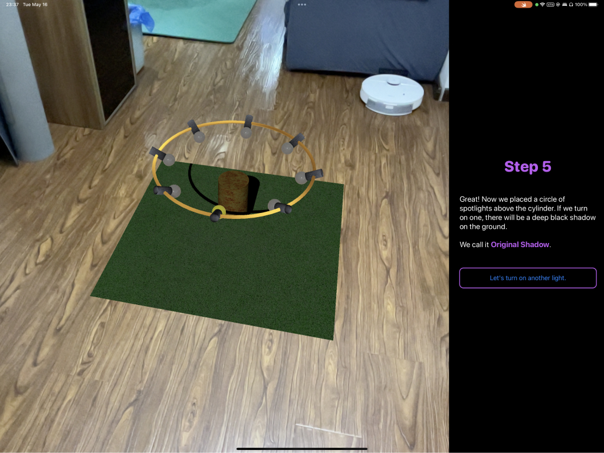
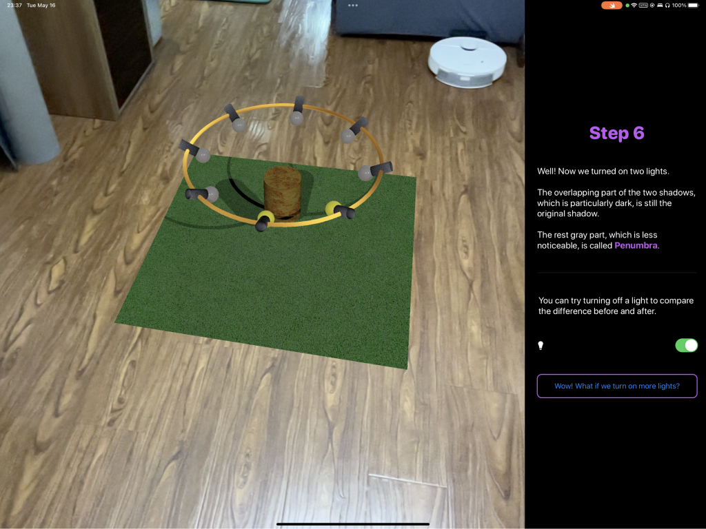
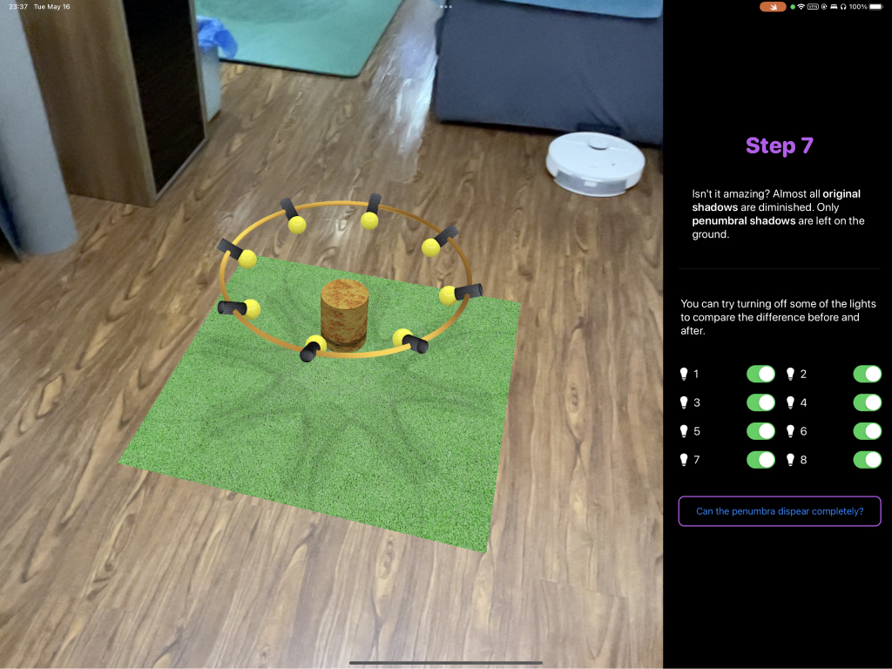
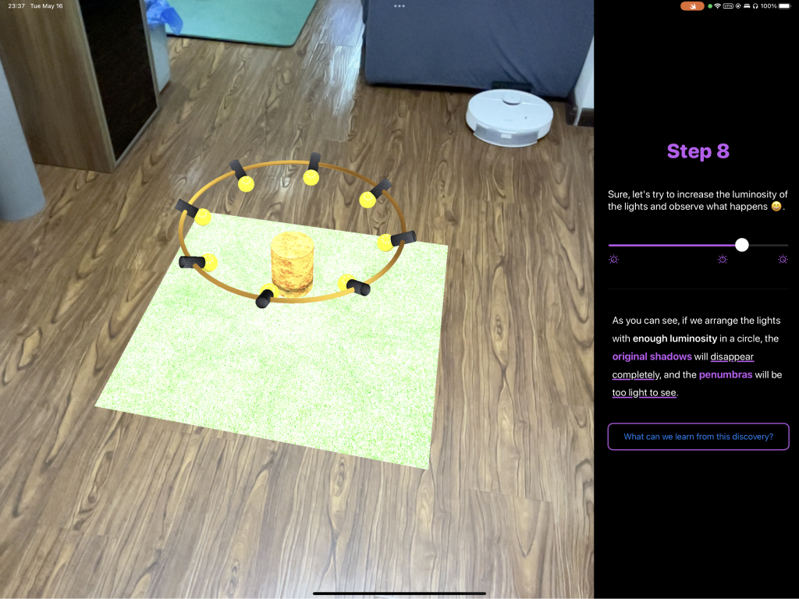
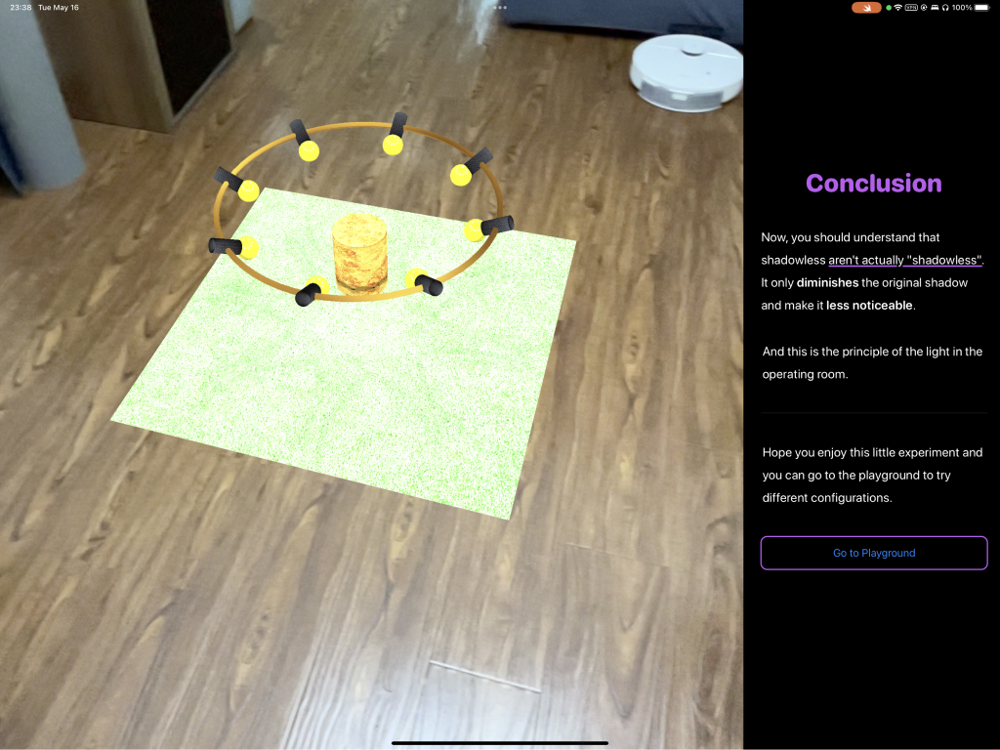
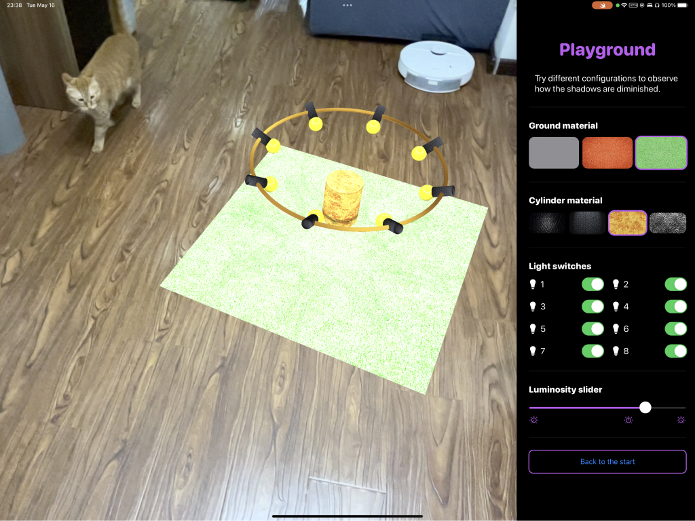

Shadowless is a AR based interactive app that helps you understand how the shadow is diminished by several light sources from different directions.

* **Step 1** Use the focus icon to locate a flat surface.

* **Step 2** After locating this position, we place an experimental platform to cast a shadow, and moreover, we can add some more vivid skins to it.

* **Step 3** Next, we placed a cylinder above the platform to cast a shadow on it.

* **Step 4** After preparing these scenarios, we place a lampstand above the cylinder and turn on a lamp. At this point, the dark shadow is called the 'original shadow'.

* **Step 5** Then, we turn on another lamp. When the central cylinder is illuminated by two lamps, the shadow will change. The overlapping part continues to maintain a deep color, while the rest of the shadow will become lighter. We call the lighter shadow 'umbra', and on this interface, we can observe the changes between the primary shadow and the umbra by switching one of the lamps on or off.

* **Step 6** Next, we turn on all the lights on the lampstand. At this point, we can hardly see the primary shadow; the surface is filled with the umbra. On this interface, we can further observe the shadow's transformation process by turning some light sources on or off. But can we completely eliminate the umbra?

* **Step 7** The answer is yes, it is related to the brightness of the light source. By increasing the brightness of the light source on the following interface, we can observe that the umbra essentially becomes invisible.

* **Step 8** What can we learn from this example? In fact, this is the principle of the shadowless lamp in the operating room. It just makes the shadow less noticeable, not truly shadowless.

* **Step 9** Lastly, I have provided a Playground where students can adjust various settings of this mini-experiment on their own.

